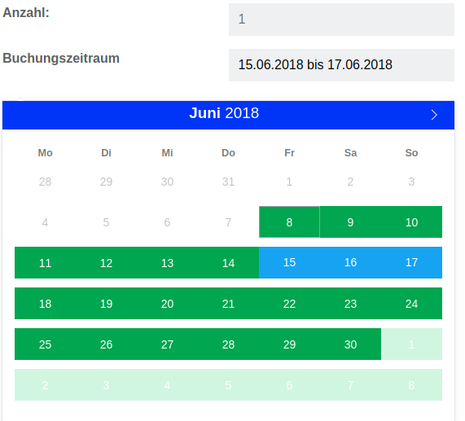

# Contao Isotope Ressource Booking Bundle

This bundle adds a booking functionality for products to [Isotope](https://isotopeecommerce.org).

## Limitations

Works currently only with [Encore Bundle](https://github.com/heimrichhannot/contao-encore-bundle).

## Setup

Install with composer or contao manager and update database afterwards.

    composer require heimrichhannot/contao-isotope-resource-booking-bundle

## Usage

To add booking functionality to a product, you need to active the booking action in the frontend module for bookable products.

In the backend, you can add the fields bookingBlock, bookingReservedDates and bookingOverview.

Field | Description
------|-----------
bookingBlock | Days to block around booking date (for shipping, printing, ...)
bookingReservedDates | Reserve date to block booking
bookingOverview | Displays a calendar containing information about booked items.